# 1.项目简介与核心功能列表。

**项目简介**:本项目是一款本地化的多模态AI文献与图像管理工具，支持论文自动多分类、语义检索、图片索引、重复文件清理等核心功能，无需联网即可完成文献的高效管理。


| 功能模块     | 功能说明                                                                     |
| -------------- | ---------------------------------------------------------------------------- |
| 论文分类     | 支持单/多主题分类，基于语义相似度自动将论文归类到CV/NLP/RL/VQA等主题目录 |
| 批量论文整理 | 批量处理文件夹中的PDF论文，自动分类并添加到向量数据库                    |
| 语义搜索     | 基于关键词语义搜索相关论文，支持按主题筛选，输出精准匹配结果               |
| 文件索引     | 仅返回符合条件的论文文件列表，方便快速定位所需文献                         |
| 重复文件清理 | 删除子文件夹中重复的文献                                                   |
| 以文搜图     | 利用多模态图文匹配技术，支持通过自然语言描述来查找本地图片库中最匹配的图像 |
| 图片索引     | 索引图片文件夹中的所有图片 |
| 删除图片索引     | 删除数据库中的所有图片索引 |

# 2.环境配置与依赖安装说明。

**2.1 环境要求**  
Python 3.8+    
操作系统：Windows/Linux/macOS  

**2.2安装依赖**  
方式 1：pip 直接安装：    
执行以下命令安装项目所需的 Python 包：  

```bash
pip install sentence-transformers torch transformers Pillow chromadb pypdf click python-dotenv 
```

方式 2：使用 requirements.txt  
1.创建requirements.txt文件，内容如下：  

```bash
sentence-transformers
torch
transformers
Pillow
chromadb
pypdf
click
python-dotenv
```

2.执行安装命令：  

```bash
pip install -r requirements.txt
```

# 3.详细的使用说明  

**3.1命令行基础格式** `python main.py [命令] [参数/选项]`  

**3.2核心命令使用说明**   
3.2.1 add_paper:添加并分类文件   
**功能**:将单篇论文添加到符合分类阈值的分类，并将论文嵌入向量存入数据库  
参数：  
path：必填，论文 PDF 文件路径  
--topics：可选，分类主题列表，默认：CV,NLP,RL,VQA  
--root：可选，自定义存储根路径，默认：D:/ai-agent  
--threshold：可选，分类相似度阈值，默认：0.4  
`python main.py add_paper "F:/papers/myPaper.pdf" --topics "CV,NLP,VQA" --threshold 0.35 --root "E:/my_papers"`

3.2.2 batch_organize:批量论文整理  
**功能**:批量处理指定文件夹中的所有 PDF 论文，自动分类并添加到数据库  
参数：  
folder_path：必填，存放 PDF 论文的文件夹路径  
--topics：可选，分类主题列表，默认：CV,NLP,RL,VQA  
--root：可选，自定义存储根路径，默认：D:/ai-agent  
--threshold：可选，分类相似度阈值，默认：0.4  
`python main.py batch_organize "F:/to_process_papers"`

3.2.3 index_images:索引图片文件夹中的所有图片  
**功能**:索引指定文件夹中的图片，生成视觉特征向量存入数据库，支持后续以文搜图.  
参数：  
image_folder：必填，图片文件夹路径  
--root：可选，自定义存储根路径，默认：D:/ai-agent  
--update:可选，遇到重复图片，是否更新，默认：跳过  
`python main.py index_images "F:/paper_images"`

3.2.4 search_image:以文搜图  
**功能**:基于文本关键词语义搜索相似图片  
参数：  
query：必填，搜索关键词  
--top-k：可选，返回结果数量，默认：5  
`python main.py search_image "CNN architecture" --top-k 10`

3.2.5 delete_all_images:删除图片索引  
**功能**:删除ChromaDB中的图片嵌入记录，不会删除本地图片文件  
`python main.py delete_all_images`

3.2.6 search_paper:语义搜索论文  
**功能**:基于文本关键词语义搜索相似论文，支持按主题筛选  
参数：  
query：必填，搜索关键词  
--top-k：可选，返回结果数量，默认：5  
--topic：可选，筛选指定主题的论文  
`python main.py search_paper "MLLM in VQA" --topic "VQA" --top-k 8`

3.2.7 list_files 文件索引  
**功能**:仅返回符合条件的论文文件路径列表，方便快速定位文献  
参数：  
--topic：可选，筛选指定主题的论文  
--query：可选，按关键词语义筛选论文  
--top-k：可选，返回最大文件数量，默认：100  
--output：可选，将结果输出到文件  
`python main.py list_files --query "视觉问答" --output "vqa_papers.txt"`

3.2.8 remove_duplicates:删除重复文档  
**功能**:扫描指定目录下的重复 PDF 论文，支持预览/强制删除  
参数：  
--root：可选，论文根目录，默认：D:/ai-agent/papers  
--force：可选，强制删除重复文件（默认仅预览）  
`python main.py remove_duplicates`
`python main.py remove_duplicates --force`

**3.3完整命令列表**  
```bash
# 查看所有命令
python main.py --help

# 命令列表：
#   add_paper      添加并分类论文文件
#   batch_organize  批量整理文件夹中的论文
#   index_images    索引图片文件夹中的所有图片
#   search_image    以文搜图
#   delete_all_images    删除图片索引
#   search_paper    语义搜索论文
#   list_files      轻量化论文文件索引（仅返回文件列表）
#   remove_duplicates 删除重复论文文档
```
# 4.技术选型说明  
**4.1模型、数据库选择**  
4.1.1 文本嵌入模型：all-MiniLM-L6-v2  
用途：  
论文文本的语义嵌入生成；  
主题描述的语义向量生成；  
搜索查询的语义向量生成，支撑论文语义检索；  

4.1.2多模态、图像嵌入模型：clip-ViT-B-32  
核心用途：  
图像的视觉特征嵌入生成；  
支撑 “以文搜图” 功能的跨模态语义匹配；  

4.1.3数据库：ChromaDB  
核心用途：  
存储论文、图像的嵌入向量及元数据（文件路径、分类主题、文件名）；  
支持向量相似度检索；  
支持元数据筛选；  

**4.2 核心功能实现流程**  
4.2.1论文文本提取与预处理  
基于PyPDF的PdfReader逐页解析PDF文件，拼接全文本；  

4.2.2多模态嵌入生成  
文本嵌入：使用all-MiniLM-L6-v2模型，对分段文本生成768维向量，取所有分段向量的平均值作为最终嵌入；  
图像嵌入：使用clip-ViT-B-32模型，将图像转为RGB格式后生成512维嵌入；  
嵌入向量格式：转为列表存储，兼容ChromaDB的数据格式要求。  

4.2.3多标签论文分类  
主题语义描述：为CV/NLP/RL/VQA分别定义专业语义描述；  
相似度计算：基于余弦相似度，计算论文文本分段与主题描述的平均相似度；  
阈值筛选：保留相似度≥0.4的主题，无匹配时返回相似度最高的主题；  
输出：按相似度降序返回匹配的主题列表。  

4.2.4向量数据库管理  

数据存储结构：
| 字段名    | 类型  | 说明 |
| -------------- | ---------------- | ---------------- |
|embeddings|	列表	|论文、图像的嵌入向量|
|metadatas	|字典	|路径、复制路径、主题、文件名|
|ids	|字符串	|唯一标识（paper_/image_ + 随机哈希）|

语义检索：基于查询文本生成嵌入，在ChromaDB中检索Top-K相似结果，支持主题元数据筛选。  

4.2.5重复文件处理  
粗筛：按文件大小分组,大小不同必不重复，减少哈希计算量；  
精准筛：对同大小文件计算哈希，哈希相同判定为重复；  
保留规则：优先保留创建时间最早、路径层级最少、文件名无后缀的文件；   
安全机制：默认预览模式，需--force参数才执行删除。  

4.2.6命令行交互封装  
基于Click封装7个核心命令，支持参数自定义  

# 5.实验结果  
**5.1add_paper:添加并分类文件**  

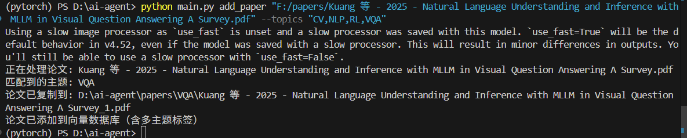

**5.2 batch_organize:批量论文整理**  
论文批量归类整理前  

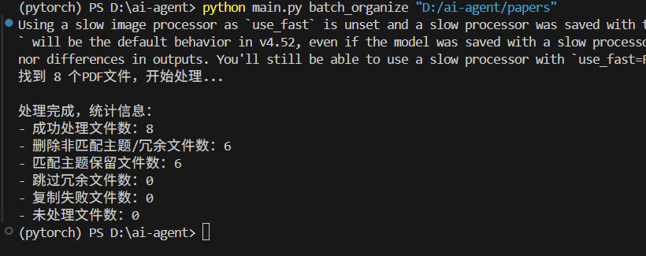  
整理后  
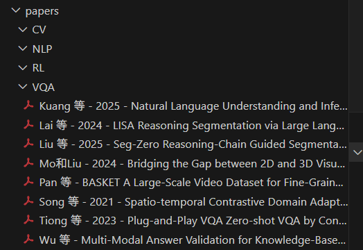

**5.3 index_images:索引图片文件夹中的所有图片**  
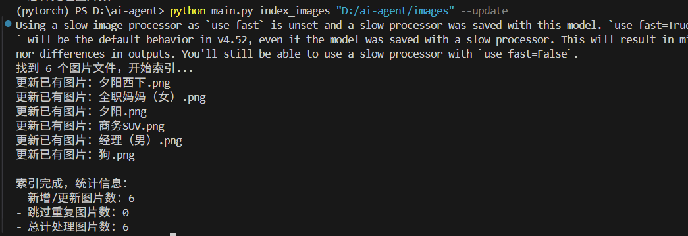

**5.4 search_image:以文搜图**  
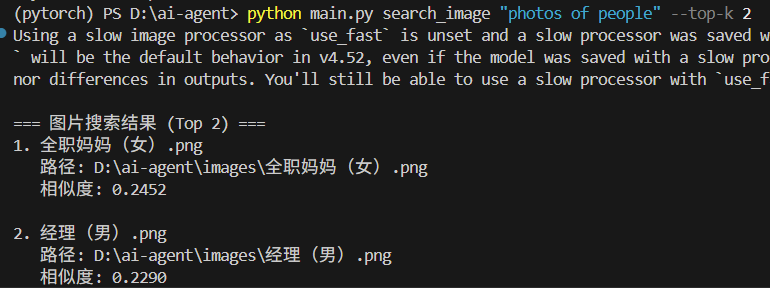

**5.5 delete_all_images:删除图片索引**  


**5.6 search_paper:语义搜索论文**  
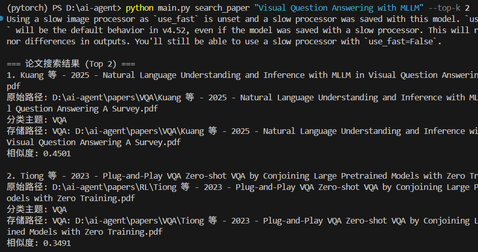

**5.7 list_files 文件索引**  
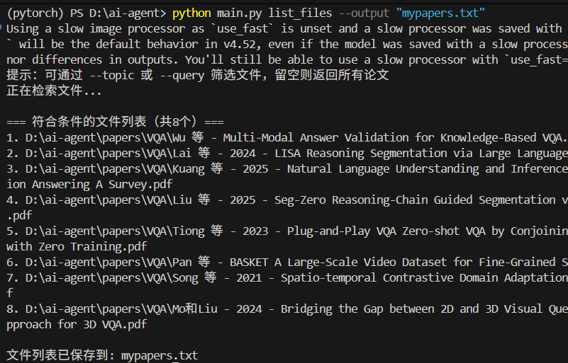
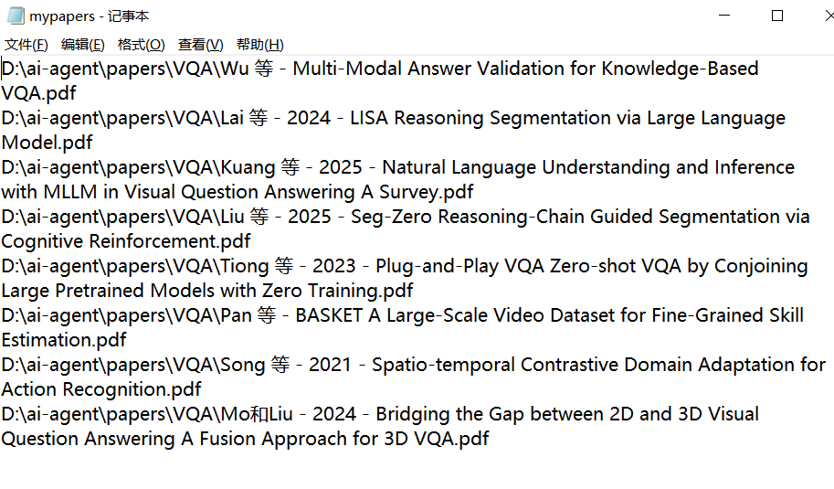

**5.8 remove_duplicates:删除重复文档**  
执行删除任务前  
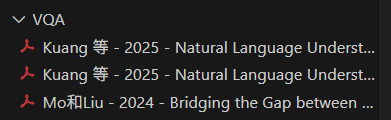
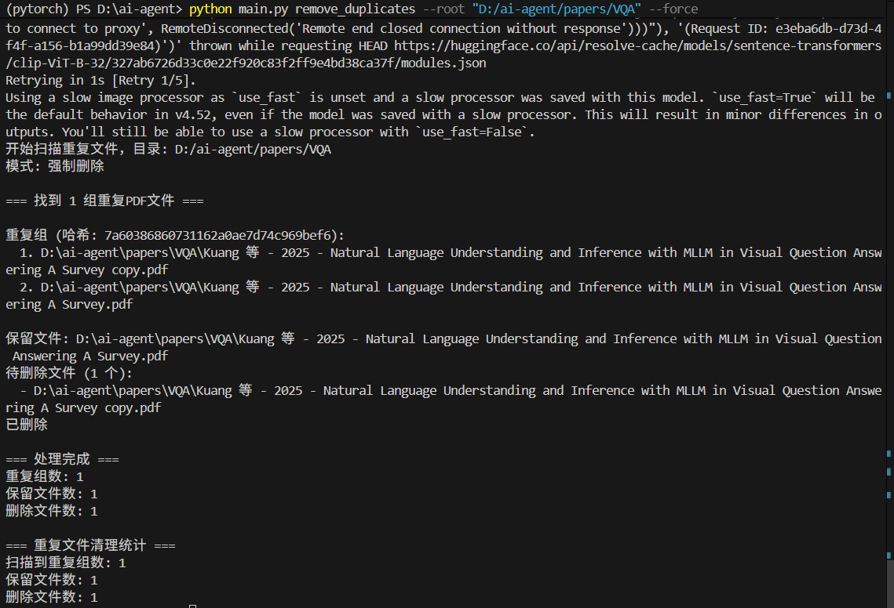
执行删除任务后  
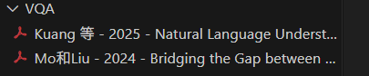